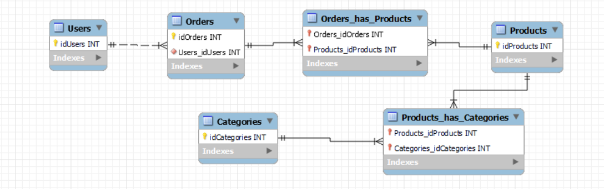

# Introducción

MySQL es un sistema de gestión de bases de datos relacionales considerado como la base de datos de código abierto más popular del mundo, especialmente para los entornos de desarrollo web que nos interesan.

# ¿Cuáles son los principales objetivos de este proyecto?
* Consolidar las consultas a una base de datos
* Comprender cómo se realizan las relaciones entre tablas
* Consolidar cómo interactuar con los datos almacenados en la base de datos.

# 1. Ejercicios W3Schools
* Realiza los siguientes ejercicios sql de w3schools.


* Realiza el quiz de w3schools.


* Recursos para hacer los ejercicios.


# 2.1 Crear diagrama
Crea un diagrama utilizando MySQL Workbench de una base de datos de un e-commerce (tienda online) con las siguientes tablas:
Tabla Users
Tabla Products
Tabla Orders
Tabla Categories
Debe mostrar los tipos de relaciones entre cada tabla. *Recuerda que en el caso de una relación muchos a muchos necesitarás una tabla intermedia.



# 2.2 Ejecute las siguientes consultas SQL
A continuación, deberá realizar las siguientes consultas SQL:

## 2.2.1 INSERTAR DATOS

* Inserte al menos 5 nuevos usuarios.

```SQL
INSERT INTO Users(
	First_Name,
	Last_Name,
    Email)
    values
    ('Mike','Lara','lara.sanchez.michael@gmail.com'),
    ('Julian','Lorca','localorca@gmail.com'),
    ('Paco','Gutierrez','gutiloco@gmail.com'),
    ('Kira','Sanchez','kirisan@gmail.com'),
    ('Agustin','Dominguez','domin@gmail.com');
```

* Inserte al menos 5 nuevos productos.

```SQL
INSERT INTO products(
	Categories_id,
    Model,
    Brand,
    Price)
    VALUE
    (2,'RTX3080','MSI',2000),
    (2,'RTX1650','Aorus',800),
    (1,'Ryzen5','AMD',350),
    (1,'Ryzen7','AMD',500),
    (1,'i7','Intel',550);
```

* Inserte al menos 5 nuevos pedidos(orders).

```SQL
INSERT INTO orders (user_id) VALUE (1),(2),(3),(4),(5);
```

* Inserte al menos 2 tipos de categorías.

```SQL
INSERT INTO Categories(Name) VALUE ('CPU'),('GPU');
```

## 2.2.2 ACTUALIZAR DATOS

Cambiar el nombre de un producto. Para ello, genera una consulta que afecte solo a un determinado producto en función de su id.
Cambiar el precio de un producto a 50€. Para ello, genera una consulta que afecte solo a un determinado producto en función de su  id.

```SQL
UPDATE products SET Model = 'ErreTeEquiss', Price = 100 WHERE id = 1;
```

## 2.2.3 OBTENER DATOS

* Seleccione todos los productos con un precio superior a 20€.

```SQL
SELECT * FROM products WHERE price > 20;
```

* Muestre de forma descendente los productos.

```SQL
SELECT * FROM products ORDER BY Price DESC;
```

* Seleccione todos los productos y que muestre la categoría a la que pertenecen.

```SQL
SELECT
CONCAT(products.Brand, ' ', Products.Model),
categories.Name
FROM Categories
INNER JOIN Products
ON categories.id = Products.Categories_id;
```

* Seleccione todos los usuarios y muestre sus pedidos.

```SQL
SELECT 
	orders.id,
    CONCAT(users.First_Name, ' ', users.last_name)
    FROM orders
    INNER JOIN users
    ON orders.user_id = users.id;
```

* Selecciona un producto por su id y que muestre la categoría a la que pertenece.

```SQL
SELECT
CONCAT(products.brand, ' ', products.model),
categories.name
FROM products
INNER JOIN categories
ON categories.id = products.Categories_id
WHERE products.id = 2; 
```

* Seleccione a un usuario por su id y muestre los pedidos que tiene.

```SQL
SELECT CONCAT(users.first_name,' ',users.last_name), orders.id AS order_id
    FROM users
    JOIN orders
    ON orders.user_id = users.id
    WHERE users.id=2;
```


<!-- Quedan por hacer las extras -->


<!-- 3. Extra
3.1.1 BORRAR DATOS
⦁ Elimina un producto por su id.

3.2 Actualizar diagrama
Crea una nueva tabla reviews y añadela al diagrama especifica también el tipo de relación.

3.3. Ejecute las siguientes consultas SQL
A continuación, deberá realizar las siguientes consultas SQL:
3.3.1 INSERTAR DATOS

Inserte al menos 5 nuevas reviews.

		
3.3.2 ACTUALIZAR DATOS

Cambia el contenido de una review

3.3.3 OBTENER DATOS

Seleccione todas las reviews.
Seleccione todos los productos con sus respectivas reviews.
Muestre un producto con sus reviews.
Muestre los productos junto a la categoría a la que pertenece y sus reviews.
Seleccione un usuario y muestre sus pedidos junto a los productos que contiene cada pedido.

3.3.4 BORRAR DATOS

⦁ Elimina una review por su id. -->
# TB_19_Relaciones_SQL
